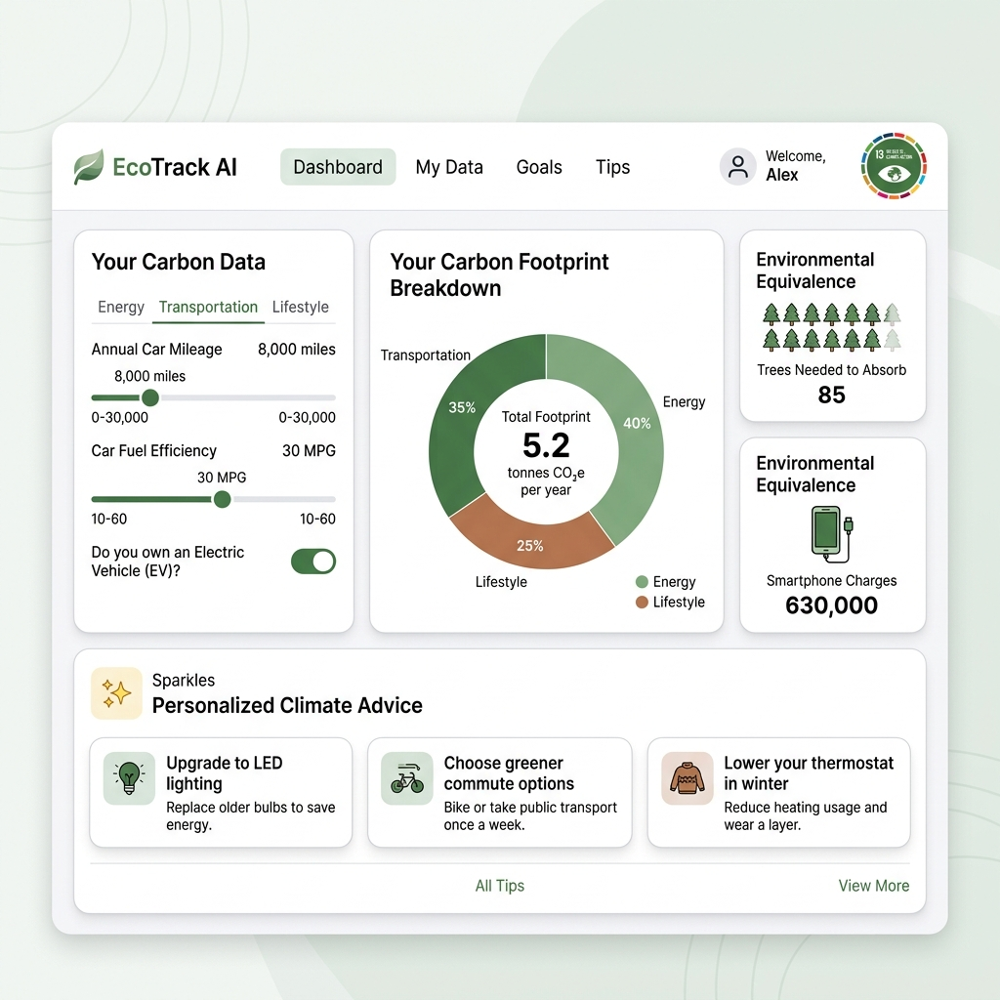

# 🍃 EcoTrack AI - UN SDG 13 Climate Action Companion

EcoTrack AI is a modern full-stack web application designed to help individuals calculate, analyze, and reduce their carbon footprint. Aligning with **United Nations Sustainable Development Goal 13: Climate Action**, the application converts household metrics into raw CO₂ output, provides relatable carbon equivalencies, and utilizes a simulated AI recommendation engine to return actionable reduction suggestions in real-time.

🔗 **Live Deployment:** [https://eco-track-ai-kappa.vercel.app/](https://eco-track-ai-kappa.vercel.app/)

---

## 🎨 Dashboard Preview

Below is a preview of the interactive dashboard layout featuring the real-time input sliders, Recharts carbon breakdown, and AI recommendations:



---

## ✨ Key Features

1.  **Real-Time Carbon Engine**: Instantly recalculates greenhouse gas emissions (in kg CO₂) across three major sectors (Energy, Transportation, and Lifestyle) as you adjust sliders.
2.  **Adaptive AI Recommendations**: A debounced (600ms) recommendation system that identifies your highest emission sector and calls a simulated LLM API route to return 3 tailored, actionable climate suggestions.
3.  **Relatable Ecological Metrics**: Translates raw CO₂ values into concrete equivalencies:
    *   **Tree Offsets Required**: Number of mature trees needed to absorb your emissions (EPA estimate: 1 tree absorbs ~1.83 kg CO₂/month).
    *   **Smartphone Charges**: Equivalent charges generated (EPA estimate: 1 charge is ~0.008 kg CO₂).
    *   **National Comparisons**: Visual bars showing how your footprint compares to the US Average (1,330 kg/month) and Global Average (380 kg/month).
4.  **Premium Responsive UX**: Sleek forest-green aesthetics, card layouts with soft shadows, custom active state tooltips, sliding tabs, and animated skeleton cards for processing states.

---

## 📐 Carbon Calculation Logic (EPA Mapped)

The utility logic handles conversions using standard coefficients:

*   **Household Energy**:
    *   *Electricity*: `kWh * 0.385` kg CO₂ (US Grid national average footprint per kWh).
    *   *Natural Gas*: `Therms * 5.3` kg CO₂ (standard natural gas therm combustion factor).
*   **Transportation**:
    *   *Gasoline Vehicle*: `(Miles / MPG) * 8.887` kg CO₂ (emissions per gallon burned).
    *   *Electric Vehicle (EV)*: `Miles * 0.115` kg CO₂ (assumes an average EV efficiency of 0.3 kWh/mile charging off the national grid mix).
*   **Lifestyle Choices**:
    *   *Dietary Patterns*: Monthly carbon cost based on diet type:
        *   🍖 Meat-heavy: 250 kg CO₂
        *   🥗 Balanced: 180 kg CO₂
        *   🧀 Vegetarian: 120 kg CO₂
        *   🌱 Vegan: 70 kg CO₂
    *   *Flights*: `Flights per Week * 4.333 (weeks/mo) * 220` kg CO₂ (based on average medium-haul flight segments).

---

## 🛠️ Technology Stack

*   **Framework**: Next.js 16 (App Router)
*   **Library**: React 19
*   **Styling**: Tailwind CSS v4 (configured via `@theme` in `globals.css`)
*   **Visualizations**: Recharts (with React 19 stable configuration)
*   **Iconography**: Lucide React

---

## 🚀 Getting Started

### Prerequisites

*   Node.js (v18 or higher)
*   npm or pnpm

### Installation

1. Clone the repository:
   ```bash
   git clone https://github.com/Shambhujadhav4/EcoTrack-AI.git
   cd EcoTrack-AI
   ```

2. Install dependencies:
   ```bash
   npm install
   ```

3. Run the local development server:
   ```bash
   npm run dev
   ```
   Open [http://localhost:3000](http://localhost:3000) in your browser to view the application.

4. Build for production:
   ```bash
   npm run build
   ```
